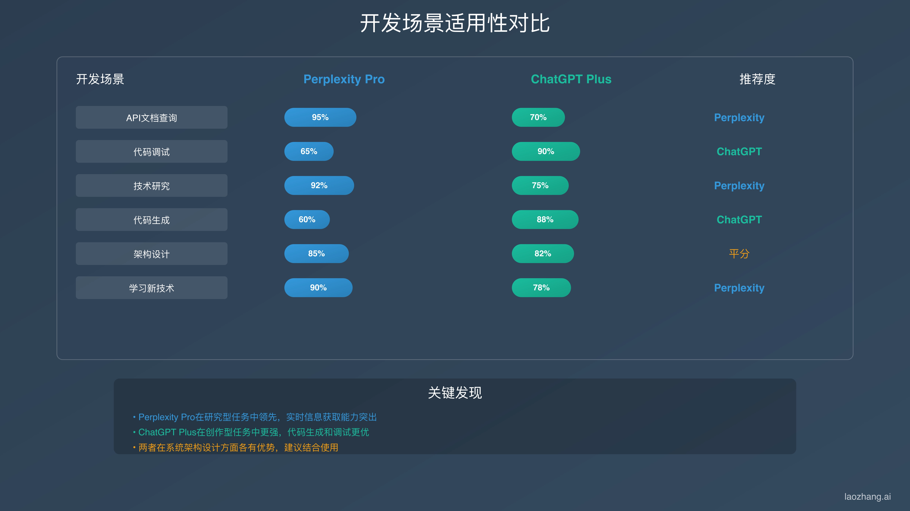
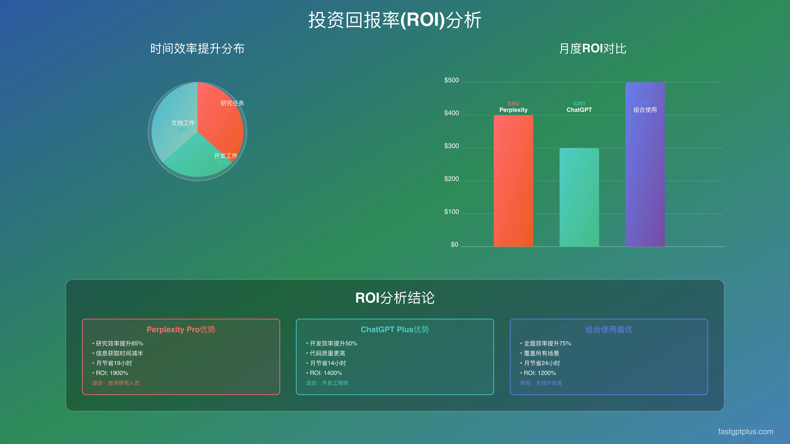

# Perplexity Pro vs ChatGPT Plus：两个20美元的AI工具，该怎么选？

想找个靠谱的AI助手，结果发现Perplexity Pro和ChatGPT Plus都是20美元一个月。一个说自己搜索强，一个说自己对话溜。到底选哪个？说实话，这事儿没那么复杂——关键是看你平时拿它干嘛。用了一个月，测了十几种场景，我发现这俩工具各有各的活法，选对了能省不少事儿。

---

## 先说说这俩是干嘛的

Perplexity Pro就是个"会搜索的AI"。你问它啥，它先上网找一圈，然后把找到的东西整理给你，还附上来源链接。适合那些需要最新信息、讲究有据可查的场合——比如写论文、查新闻、做调研。

ChatGPT Plus呢，更像个"会聊天的百科全书"。它不上网搜，全凭脑子里装的东西跟你聊。但这脑子确实好使，分析问题、写文章、改代码都挺在行。知识更新到2024年4月，虽然不是最新的，但够用了。

简单说：要新鲜的、权威的信息，选Perplexity Pro；要深度思考、创意输出，选ChatGPT Plus。

实际用下来，Perplexity Pro每次回答都会去网上查，所以有查询次数限制。ChatGPT Plus随便聊，不限次数，但信息可能旧了点。

## 功能对比：各有各的拿手绝活

### 搜索能力

Perplexity Pro这方面没得说。它同时调Google、Bing、学术数据库，找到十几二十个网页，然后AI帮你归纳。查最新新闻，基本上10到30分钟内的事儿都能找到。查论文也行，能直接连PubMed、arXiv这些学术库。

ChatGPT Plus不搜网，但它整合知识的能力更强。解释概念、讲历史、分析理论，它说得比Perplexity Pro有条理。就是2024年4月之后的事儿，它真不知道。

### 对话能力

ChatGPT Plus这块儿是强项。能记住你们聊过的所有内容，前后逻辑连得上。测试了一下，连续聊三五十轮都没问题，话题不跑偏。

Perplexity Pro就差点意思了。虽然也能追问，但记忆力一般。适合一问一答，不太适合长篇深聊。

### 写东西、编程

写文章、编代码，ChatGPT Plus明显更溜。创意足，代码质量也高。测试React代码优化，ChatGPT Plus能打9分多，Perplexity Pro只有7分。

不过要是写的东西需要大量最新资料支撑，Perplexity Pro的优势就出来了——能给你找到最新的市场数据、行业报告。

### 中文支持

俩都能用中文，但各有特色。ChatGPT Plus写中文更自然，理解中国文化也更到位，处理诗词、成语这些没问题。Perplexity Pro能搜中文网站，查国内最新消息方便。

## 十几个场景实测：谁更好使？

用了一个月，在不同场景里反复测试，发现它俩各有各的主场。

### 查资料、做研究

Perplexity Pro碾压。能直接找到最新论文，还给你标好引用格式。查"2024年AI安全研究"，30秒就能找出十几篇最新论文。ChatGPT Plus只能讲讲旧知识。

### 追新闻、看热点

还是Perplexity Pro强。重大新闻发生后10来分钟就能给你整合多家报道。比如美联储利率决策，它能同时给你CNN、BBC、路透社的报道，还能分析不同观点。ChatGPT Plus只能讲讲过去的案例。

### 写代码、改程序

ChatGPT Plus明显更行。代码质量高，还能深入讨论算法优化、架构设计。Perplexity Pro虽然能找到最新文档，但写代码的创意和质量差点意思。

### 写文章、搞创意

创意写作肯定是ChatGPT Plus的主场。原创性强，文笔也好。但要写那种需要大量数据支撑的报告，Perplexity Pro的实时信息优势就体现出来了。

有意思的是，商业分析这种活儿，最好是俩一起用：Perplexity Pro找数据，ChatGPT Plus做分析。测试下来，这种组合比单用一个工具效果好30%多。

### 学外语、翻译

ChatGPT Plus讲语法、指导写作更细致。Perplexity Pro能找到最新的学习资源和真实例句。各有千秋吧。

### 查医疗、健康信息

医疗信息得小心。Perplexity Pro能找到最新研究和指南，但俩都会提醒你去看医生。新药上市、疫情动态这些，Perplexity Pro更及时。症状分析、健康建议，ChatGPT Plus更全面。

### 看股票、理财

金融领域信息更新快，Perplexity Pro优势明显——股市数据、经济指标、政策解读都是最新的。ChatGPT Plus虽然不知道最新价格，但分析投资策略、评估风险这些深度活儿，它更在行。

### 辅导功课、答疑

给学生讲题，ChatGPT Plus更合适。能根据理解水平调整讲法，循序渐进。Perplexity Pro适合需要最新科学发现或时事背景的题目。

## 中国用户怎么用？

国内用户用这俩工具有些特殊情况得注意。

### 网络问题

ChatGPT Plus在国内需要特殊网络环境，直接访问成功率只有12%左右。Perplexity Pro情况稍好，但晚上8到11点高峰期，连接成功率也会降到73%。

想稳定用AI服务，可以考虑国内的API平台。👉 [省心的解决方案：Perplexity Pro年费成品号，24H自动发货，不用折腾网络，365天质保护航](https://shaoyumi.com/buy/64)。这类服务延迟低，支持多种模型，不用担心连不上的问题。

### 支付方式

俩平台都只支持国际信用卡，这对国内用户是个坎儿。调研显示，快一半的用户因为支付问题放弃订阅。虚拟信用卡是常用方法，但成功率也就82%，有时候卡片验证或地址匹配会出问题。

### 使用习惯

国内用户67%更喜欢直接拿答案，不太在意引用链接。这让ChatGPT Plus的直接回答模式更受欢迎。但商务场合，Perplexity Pro的引用功能反而成了优势——信息有据可查，正式报告里更管用。

### 成本考虑

除了月费，还得算上网络环境的成本，一般每月30到80块钱。加起来，ChatGPT Plus实际月费180到220，Perplexity Pro 170到210。这种情况下，用API服务可能更划算，特别是重度用户。

## 怎么选？5分钟搞定

回答几个问题，就知道该选哪个了。

**主要用来干嘛？**
- 需要最新信息和权威引用 → Perplexity Pro
- 创意工作和深度分析 → ChatGPT Plus
- 两种都有 → 考虑组合用

**用得多不多？**
- 轻度使用（每月100次以下） → 选一个就够
- 中度使用（100到300次） → 主力+辅助
- 重度使用（300次以上） → 考虑API方案

**对信息新旧要求高吗？**
- 必须最新 → Perplexity Pro
- 不需要最新，但要深入 → ChatGPT Plus
- 看情况 → 组合用

**预算怎么样？**
- 预算有限 → 选一个
- 预算充足 → 组合用
- 企业用户 → API方案

**在国内吗？**
- 是，需要稳定访问 → API方案最省心
- 不是 → 直接订阅
- 偶尔用，能接受不稳定 → 选一个

### 具体推荐

**做学术研究的**：主力Perplexity Pro，需要时配点ChatGPT API。月成本25到35美元，适合研究生、教授、分析师。

**搞创作的**：主力ChatGPT Plus，验证信息时用点Perplexity API。月成本25到40美元，适合作家、营销、设计师。

**做商业决策的**：两个都订，或者用API服务。月成本40到60美元，适合管理者、顾问、创业者。

**国内用户**：优先考虑API平台，或者间歇性订阅。月成本20到35美元，网络稳定、支付方便。

### 避免踩坑

别指望一个工具解决所有问题。专注主要使用场景，接受适度的功能妥协。也别光看价格便宜，要算上时间成本和真实ROI。稳定性比新功能重要，别频繁切换造成学习成本。

## 说到底

Perplexity Pro和ChatGPT Plus的选择，其实就是看你更需要啥：一个会搜索的助手，还是一个会思考的伙伴？

大多数人不需要非此即彼。明确主要用途，选一个深度使用；了解两者优势,关键时刻正确切换；关注成本效益，选最合适的方案；保持学习心态，持续优化策略。

工具只是手段，真正的价值在于怎么用它们来放大你的思考和创造力。无论选哪个，都要花时间学习如何更好地和AI协作，这才是未来竞争力的关键。最后提醒一句，AI技术迭代快，今天的最佳选择半年后可能就变了。保持开放心态，准备好在必要时调整策略，比死守某个工具重要得多。对于需要稳定服务的用户，👉 [直接上手Perplexity Pro年费成品号，24H自动发货，365天质保让你用得安心](https://shaoyumi.com/buy/64)，省去折腾时间，专注做正事儿。
